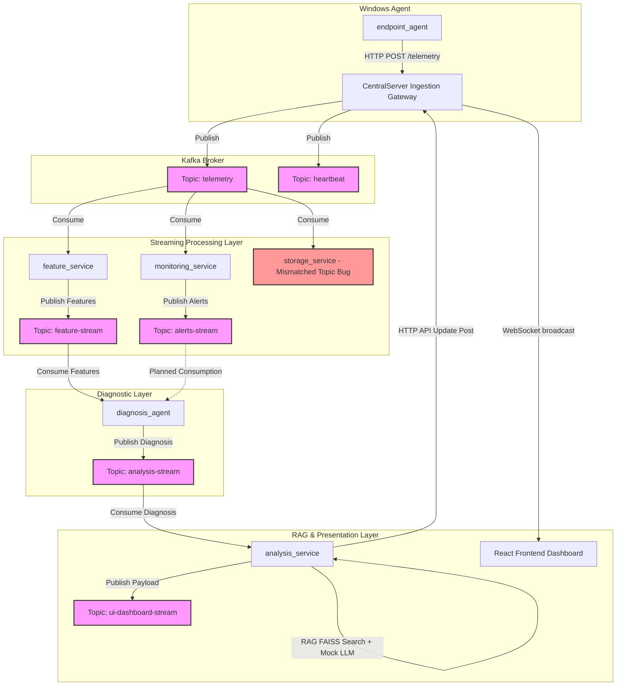

# 🚀 Apache Kafka Interview Guide — NexusOps Telemetry Pipeline

This document serves as an exhaustive, technical reference for how **Apache Kafka** is integrated into the NexusOps real-time telemetry and AIOps pipeline. It is structured to help you answer any Kafka-related question in technical interviews, detailing topics, schemas, data flows, configurations, performance metrics, and architectural gaps.

---

## 1. Architectural Role: Why Kafka?

In NexusOps, Apache Kafka acts as the **central, distributed event backbone**. It decouples the telemetry ingestion layer (FastAPI gateway) from downstream processing engines (features, monitoring, rules, storage, ML diagnosis, and RAG).

### Key Interview Talking Points (Architectural Decisions):
*   **Decoupling & Async Processing:** Endpoint agents push raw OS metrics over HTTP. The gateway publishes events to Kafka immediately. Downstream services process data asynchronously at their own rate without blocking ingestion.
*   **Stream Replayability (Log-Centric Architecture):** Unlike traditional message queues (like RabbitMQ) which delete messages once consumed, Kafka retains events on disk. This allows the `monitoring_service`, `feature_service`, and `storage_service` to consume the *same* raw telemetry stream independently and asynchronously. If one service goes down, others continue unaffected, and the failed service can catch up by replaying the logs from its last committed offset.
*   **Backpressure Handling:** Kafka serves as a buffer. Under peak traffic loads or during downstream consumer downtime, Kafka stores events on disk (commit log), protecting downstream services from being overwhelmed.
*   **Scale & Partitioning:** Data is key-partitioned by `system_id`. This guarantees in-order processing of metrics for any single endpoint, which is critical for sliding-window and rate-of-change computations, while allowing horizontal scaling across multiple consumers.

---

## 2. Kafka Topic Directory

The system uses **7 distinct Kafka topics** (5 core active, 1 planned/mismatched, 1 dead topic) to orchestrate data through the multi-stage pipeline:

| Topic Name | Producer Service | Consumer Service(s) | Consumer Group ID | Data Description | Message Key |
| :--- | :--- | :--- | :--- | :--- | :--- |
| **`telemetry`** | `CentralServer` | `monitoring_service`<br>`feature_service` | *None (Anonymous)*<br>`feature-aggregator-group` | Raw system performance payloads containing CPU, RAM, disk, network, process details, and security lists. | `system_id` |
| **`heartbeat`** | `CentralServer` | *None (Currently unconsumed)* | *None* | Lightweight alive checks from endpoint agents to monitor system online/offline status. | `system_id` |
| **`alerts-stream`** | `monitoring_service` | `diagnosis_agent` *(Configured, but currently mocked)* | `diagnosis-agent-group` | Pydantic validation alert objects representing rule-based violations (e.g. thresholds, spikes). | `system_id` |
| **`feature-stream`** | `feature_service` | `diagnosis_agent` | `diagnosis-agent-group` | Multi-layered engineered features (sliding averages, volatility metrics, pattern flags) used for diagnosis. | `system_id` |
| **`analysis-stream`** | `diagnosis_agent` | `analysis_service` | `analysis-service-group` | Deterministic root-cause verdicts (severity, priority, evidence, and confidence scores). | `system_id` |
| **`ui-dashboard-stream`**| `analysis_service` | *Planned (Frontend gateway)* | *Planned* | Final UI-ready JSON response (RAG solutions, persona-specific explanations, unified metrics). | `system_id` |
| **`telemetry-stream`** | *None (Orphaned)* | `storage_service` | `storage-group` | **Mismatched topic (bug).** The storage service is configured to consume here, but nothing produces to it. | `system_id` |

---

## 3. End-to-End Event Pipeline Flow

The life of a telemetry event through the Kafka ecosystem follows a structured multi-stage processing pipeline:



---

## 4. Topic Schemas & Data Structure

### 4.1 `telemetry` Topic Payload
Published by `CentralServer` as a flat JSON schema:
```json
{
  "system_id": "SYS-001",
  "timestamp": "2026-06-12T14:02:49.123456",
  "type": "telemetry",
  "hardware": {
    "cpu": { "usage_percent": 84.2, "frequency_mhz": 3100, "core_count": 8, "context_switches": 128942 },
    "memory": { "total": 17179869184, "available": 2576980377, "used": 14602888807, "percent": 85.0 },
    "disk": { "total": 512110280704, "used": 486504766668, "free": 25605514036, "percent": 95.0, "read_bytes": 1049280, "write_bytes": 52428800 }
  },
  "software": {
    "process": { "process_count": 142, "top_cpu_processes": [{"name": "MemCompression", "pid": 4, "cpu_percent": 45.2, "memory_percent": 12.0}], "top_memory_processes": [...] }
  },
  "security": { "suspicious_process_count": 0, "suspicious_processes": [] }
}
```

### 4.2 `feature-stream` Topic Payload
Published by `feature_service` after evaluating sliding windows:
```json
{
  "system_id": "SYS-001",
  "timestamp": 1774328329.123,
  "cpu": {
    "current": 84.2, "avg": 81.1, "variance": 12.4, "volatility": "medium", "trend": "increasing", "spike": false, "sustained_high": true
  },
  "memory": {
    "current": 85.0, "growth_rate": 2.4, "leak_pattern": true, "time_to_critical": 3600
  },
  "disk": {
    "current": 95.0, "fill_rate_bytes_sec": 1048576, "fill_rate_mb_sec": 1.0, "time_to_full_sec": 25605, "time_to_full_hr": 7.1, "risk": "high"
  },
  "process": { "dominant": "MemCompression", "cpu_share": 45.2 },
  "correlation": { "cpu_root_process": "MemCompression", "disk_risk_level": "critical" },
  "flags": { "high_cpu": true, "memory_risk": true, "disk_critical": false },
  "meta": { "window_size": 5, "computed_at": "2026-06-12T14:03:00.123456" }
}
```

### 4.3 `analysis-stream` Topic Payload
Published by `diagnosis_agent` after rule/confidence logic:
```json
{
  "system_id": "SYS-001",
  "timestamp": "2026-06-12T14:03:01.456789",
  "diagnosis": "Disk saturation risk due to rapid fill rate",
  "stage": "critical",
  "priority": 1,
  "confidence": 0.9,
  "signals": {
    "memory_pressure": true,
    "disk_saturation": true,
    "process_bottleneck": true
  },
  "evidence": {
    "disk_percent": 95.0,
    "fill_rate_mb_sec": 1.0,
    "dominant_process": "MemCompression"
  }
}
```

---

## 5. Technology Stack & Client Configurations

All microservices are built in **Python**, utilizing **FastAPI** as the framework wrapper and standardizing on the **`aiokafka`** library for asynchronous Kafka producers and consumers.

### 5.1 Kafka Connection Parameters
Downstream consumer services inherit the following configuration guidelines:
*   **Bootstrap Server:** `localhost:9092` (configured via env variables `KAFKA_BOOTSTRAP_SERVERS` or `KAFKA_BROKER`).
*   **Key Serialization:** Strings are serialized to UTF-8 (`system_id` as the partition key).
*   **Value Serialization:** Payloads are serialized to and deserialized from JSON strings (`utf-8`).
*   **Auto Commit (`enable_auto_commit=True`):** Consumers automatically commit their read offsets in the background, simplifying offset management.
*   **Offset Reset (`auto_offset_reset`):**
    *   **`earliest`** in `storage_service` and `feature_service` to ensure no telemetry metrics are skipped on consumer restarts.
    *   **`latest`** in `analysis_service` to process only live, real-time diagnostic verdicts, ignoring stale historical entries.

---

## 6. Key Performance Metrics & Calculations

Be ready to cite these hard mathematical parameters to validate the scalability of this architecture:

*   **Ingestion Rate:** The pipeline scales to support **10,000+ monitored endpoints** through topic partition keys.
*   **Throughput Statistics:** Per 100 endpoints, at a 60-second polling interval, the pipeline processes:
    *   **144,000 telemetry messages per day** on a single Kafka broker.
    *   Total raw data volume of **216 MB per day** (avg payload size of 1.5 KB per message).
*   **Latency Budget Allocation:**
    *   **Kafka Topic-to-Topic Transit Latency:** **2ms - 8ms** (the time it takes a message to move from a producer through the broker to a subscribed consumer).
    *   **End-to-End Diagnostic Pipeline Latency:** **20ms - 55ms** (excluding LLM translation). It is composed of FastAPI Gateway (5-15ms) + Kafka Broker (2-8ms) + Feature calculation (10-20ms) + Diagnostic rule engine (2-5ms).

---

## 7. Infrastructure: Docker Compose Setup

Kafka is orchestrated using Confluent's containerized image stack:
*   **Broker Image:** `confluentinc/cp-kafka:7.5.0` (exposes port `9092`).
*   **Coordinator Image:** `confluentinc/cp-zookeeper:7.5.0` (exposes port `2181`).
*   **Healthchecks & Dependency Resolution:**
    *   Zookeeper is configured with a healthcheck: `echo ruok | nc localhost 2181`.
    *   The Kafka service uses a dependency condition: `depends_on zookeeper: condition: service_healthy`. This prevents the Kafka broker from starting before Zookeeper is fully operational, eliminating broker connection retry crashes.

---

## 8. Critical Codebase Gaps & Bugs (Showcase Deep Expertise)

In interviews, discussing what is *wrong* with your current system is a great way to showcase senior-level system design maturity. Identify these three core Kafka implementation gaps in the repository:

### 🔴 Bug 1: Storage Service Topic Mismatch
*   **Issue:** The `storage_service/config.py` is configured with `KAFKA_TOPIC = "telemetry-stream"`, while the `CentralServer/server.py` publishes raw agent payloads to `telemetry`.
*   **Impact:** The storage service never receives data, leaving MongoDB database collections (`raw_telemetry` and `system_metrics`) completely empty.
*   **Fix:** Change the configuration variable in `storage_service/config.py` to target the `telemetry` topic.

### 🔴 Bug 2: Hardcoded Alerts inside the Diagnosis Agent
*   **Issue:** The `diagnosis_agent/config.py` maps `ALERT_TOPIC = "alerts-stream"`, but the consumer client only reads from `feature-stream`. Inside `diagnosis_agent/processor.py`, `mock_alerts = []` is hardcoded.
*   **Impact:** Real-time anomaly alerts generated by the `monitoring_service` are never fed into the diagnostic engine. This reduces the accuracy of the multi-signal agreement score in the confidence engine.
*   **Fix:** Extend the `diagnosis_agent` client to consume from both `feature-stream` and `alerts-stream`, correlate records by `system_id` within a time window, and feed the active alerts into the diagnostic context builder.

### 🟡 Bug 3: Orphaned Heartbeat Topic
*   **Issue:** The `CentralServer` ingests agent heartbeats and publishes them to the `heartbeat` Kafka topic. However, there is no consumer service subscribed to this topic.
*   **Impact:** Heartbeats are written to the broker and discarded after the retention period, providing no actual value to system status indicators.
*   **Fix:** Implement a dedicated `heartbeat_service` or extend `monitoring_service` to consume from `heartbeat`, updating system status tags in MongoDB or notifying of endpoint offline states if a heartbeat is missed for $>180$ seconds.

### 🟡 Bug 4: Lack of Error Recovery & Dead Letter Queues (DLQ)
*   **Issue:** In the consumer loops (e.g. `storage_service`), if a message fails serialization/deserialization or triggers database database insert failures, the message is skipped or logged as an error without recovery.
*   **Impact:** Temporary database outages or corrupted payloads can halt consumption or cause unrecoverable data loss.
*   **Fix:** Implement a Dead Letter Queue (DLQ) pattern. Corrupted or unprocessable payloads should be written to a `telemetry-dlq` topic, allowing offsets to commit and letting administrators inspect failures without halting the real-time processing pipeline.
