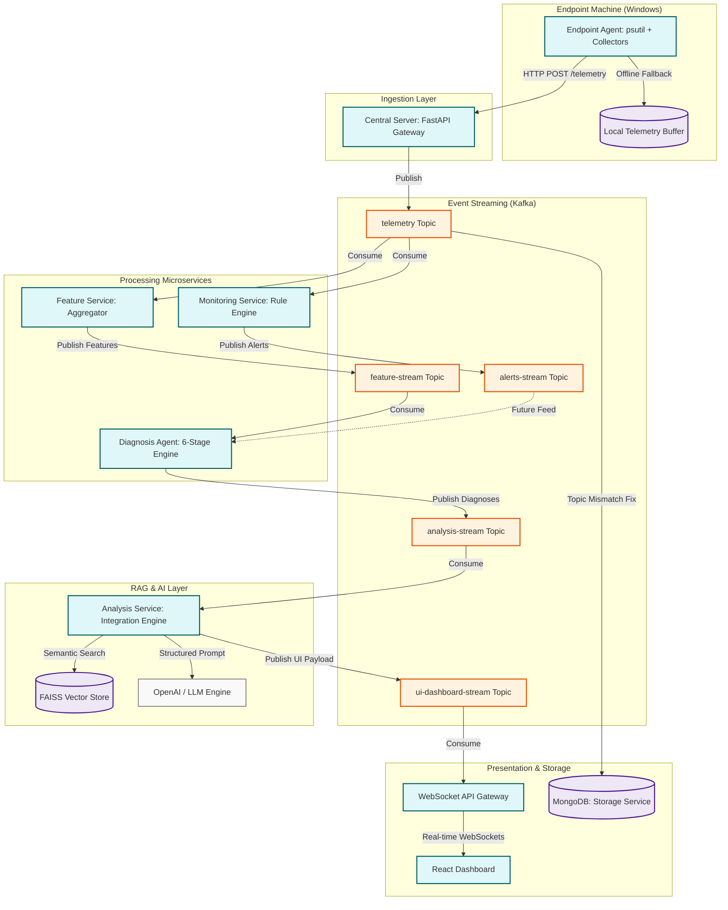

# 📊 System Health Intelligence Platform (NexusOps)
## Technical Analysis & Interview Defense Report

> **Scope:** Full-Stack Architecture, Data Pipelines, Feature Engineering, Deterministic Diagnosis, RAG Retrieval, and Interview Narrative Frameworks.  
> **Prepared For:** Technical Interview Preparation (STAR/CARL, System Design, Architecture Defense).

---

## Table of Contents
1. [SECTION 1 — PROJECT OVERVIEW](#section-1--project-overview)
2. [SECTION 2 — BUSINESS / PROBLEM CONTEXT](#section-2--business--problem-context)
3. [SECTION 3 — SYSTEM ARCHITECTURE & COMPONENTS](#section-3--system-architecture--components)
4. [SECTION 4 — DATA LIFE CYCLE & PIPELINE](#section-4--data-life-cycle--pipeline)
5. [SECTION 5 — FEATURE ENGINEERING](#section-5--feature-engineering)
6. [SECTION 6 — DETERMINISTIC DIAGNOSIS ENGINE](#section-6--deterministic-diagnosis-engine)
7. [SECTION 7 — RETRIEVAL-AUGMENTED GENERATION (RAG) PIPELINE](#section-7--retrieval-augmented-generation-rag-pipeline)
8. [SECTION 8 — PERSONA-SPECIFIC AI TRANSLATION](#section-8--persona-specific-ai-translation)
9. [SECTION 9 — SECURITY & COMPLIANCE](#section-9--security--compliance)
10. [SECTION 10 — PLATFORM INTEGRATION & FRONTEND WORKFLOWS](#section-10--platform-integration--frontend-workflows)
11. [SECTION 11 — ENGINEERING TRADEOFFS & ARCHITECTURAL DEFENSE](#section-11--engineering-tradeoffs--architectural-defense)
12. [SECTION 12 — CRITICAL BUG & GAP ANALYSIS](#section-12--critical-bug--gap-analysis)
13. [SECTION 13 — SCALABILITY & PRODUCTION READY ROADMAP](#section-13--scalability--production-ready-roadmap)
14. [SECTION 14 — INTERVIEW NARRATIVE: STAR/CARL STORIES](#section-14--interview-narrative-starcarl-stories)
15. [SECTION 15 — SYSTEM HEALTH INDEX FORMULA](#section-15--system-health-index-formula)

---

## SECTION 1 — PROJECT OVERVIEW

### Core Profile
*   **Project Name:** NexusOps (System Health Intelligence Platform)
*   **One-Line Description:** A full-stack, real-time AIOps monitoring and diagnostic platform that uses deterministic rule engines and Retrieval-Augmented Generation (RAG) to monitor endpoints, identify root causes, and translate complex technical diagnostics into persona-specific explanations.
*   **Main Problem Solved:** High Mean Time to Resolution (MTTR) and operational fatigue caused by noisy, context-poor alerting and a lack of clear, actionable status communications between system metrics, IT technicians, and end-users.
*   **Why Existing Solutions Fail:** Traditional monitoring tools (e.g., Datadog, Prometheus) generate massive alert storms without correlating resource patterns or diagnostic contexts, forcing manual triage. Conversely, purely generative AI-first diagnostic agents suffer from non-deterministic hallucinations, high execution latency, and unsustainable API costs.
*   **Primary Users:** 
    *   *End-Users:* Employees experiencing machine slowness who need clear, plain-English updates and safe, self-remediating tasks.
    *   *IT Technicians:* Support staff who need detailed diagnostics, raw metrics, chronological event timelines, and technical verification checklists.
    *   *IT Administrators:* Managers who require high-level risk distribution charts, system hardware assessments, and budget-governed hardware replacement approval workflows.
*   **Core Value Proposition:** Dramatically accelerates MTTR by instantly transforming raw OS-level telemetry into deterministic root-cause inferences, enriching those inferences with semantic knowledge base searches, and delivering persona-customized dashboards that bridge the communication gap between business users and technical staff.
*   **Key Innovation:** The **"Deterministic First, Generative Second"** architecture. System anomalies, metric states, and diagnostic root-cause determinations are computed using mathematical equations and static rules. Generative AI is strictly restricted to translation and interface generation (populating structured JSON schemas), ensuring zero diagnostic hallucinations, high reliability, and predictable performance.

### Narrative: What is this project really about?
NexusOps is an enterprise-grade AIOps platform built to solve the systemic challenges of endpoint reliability and operational scale. In a modern corporate environment, IT support queues are flooded with vague tickets ("my laptop is slow"). Resolving these tickets requires technicians to manually collect system logs, analyze background processes, and check hardware states. This process wastes valuable time while users are left in the dark, and administrators must approve hardware replacements without clear, data-backed justification.

NexusOps changes this paradigm by running a lightweight agent on monitored Windows endpoints. The agent gathers deep OS-level telemetry (CPU, memory, disk, network, processes, and security) and streams it into a highly scalable, real-time microservices pipeline backed by Apache Kafka. Instead of feeding this raw data to a costly and unpredictable LLM, the platform routes it through a multi-stage feature engineering and deterministic diagnosis pipeline. This logic maps raw resource states to defined behavioral patterns, producing a concrete root-cause verdict in milliseconds.

Once a deterministic diagnosis is reached, the system triggers the RAG retrieval layer. It generates a semantically rich query based on the active signals and queries a FAISS vector store containing a structured knowledge base of known IT issues and solutions. The retrieve-and-rerank engine filters out irrelevant articles by running resource-specific checks and checking for contradictions. 

Finally, the diagnostic verdict, real-time telemetry, and RAG articles are packaged and sent to an LLM. Using structured output schemas, the LLM translates the complex technical diagnostics into three customized views: a simple status update for the end-user, an actionable step-by-step resolution script for the technician, and a hardware risk assessment for the administrator. The entire state is served dynamically via WebSockets to a role-based React dashboard, creating a transparent, closed-loop diagnostic ecosystem.

---

## SECTION 2 — BUSINESS / PROBLEM CONTEXT

### Real-World Relevance & Pain Points
Unplanned system degradation on enterprise endpoints is one of the leading contributors to employee productivity loss and IT support costs. Before the implementation of NexusOps, organizations suffered from several major operational pain points:

1.  **Metric Silos & Alert Fatigue:** Standard monitoring platforms generate generic warnings (e.g., "CPU at 90%") without correlating it to process behavior or disk write activity. This leads to alert fatigue, causing technicians to ignore critical indicators.
2.  **Technician Triage Backlogs:** When an endpoint becomes sluggish, support staff must manually query process lists, examine Event Viewer logs, and run diagnostic commands. This manual workflow extends MTTR from minutes to hours.
3.  **Governance & Financial Waste:** IT administrators lack unified data to support hardware acquisitions. They are forced to rely on subjective technician notes to approve motherboard, disk, or RAM replacements, resulting in sub-optimal budget allocation.
4.  **End-User Anxiety:** When a device experiences degradation, the user has no visibility into what is wrong or when it will be fixed. This leads to repeated support calls, ticket duplication, and friction between business units and IT support teams.

### Operational Consequences of Absence
Without a system like NexusOps, an enterprise operates in a reactive state. Mild issues like memory leaks in background services (e.g., `svchost.exe` groups) or rapid disk fill-ups from unrotated logs slowly degrade system performance. Left unmonitored, these issues escalate into cascading failures: memory exhaustion forces excessive pagefile swapping, causing disk I/O thrashing, which blocks CPU registers and crashes the OS. 

For the business, this translates to sudden laptop blue-screens, disrupted client meetings, delayed software deployments, and high IT overhead.

### Practical Use Cases
*   **Svchost.exe Memory Leak Isolation:** Automatically detecting memory growth in service host groups, identifying the leaking process, and guiding the technician to isolate the service via command-line arguments.
*   **Runaway Application Log Remediation:** Spotting rapid disk space consumption (e.g., IIS or SQL logs filling up at >5MB/s), mapping the path, and suggesting immediate log rotation commands before the disk hits 100% capacity.
*   **Automated Hardware Replacement Lifecycle:** Tracking a system with a failing hard drive, generating a verified replacement recommendation, and prompting the administrator to approve the swap based on historical telemetry.

---

## SECTION 3 — SYSTEM ARCHITECTURE & COMPONENTS

The architecture of NexusOps is structured as a collection of decoupled, event-driven microservices designed for high throughput, scalability, and resilience.



### Microservice Directory

#### 1. Endpoint Agent
*   **Technology:** Python 3.10+, `psutil`, `requests`.
*   **Responsibility:** A daemon running on the endpoint. It employs 7 specialized collector modules (CPU, Memory, Disk, Network, Process, Security, and System) to sample system metrics every 60 seconds.
*   **Resiliency:** Incorporates an API client with a 3-retry mechanism. If the central gateway is unreachable, payloads are written to a local file-based JSON buffer (`buffer/telemetry_buffer.json`) and flushed sequentially once connectivity is restored.

#### 2. Central Server
*   **Technology:** FastAPI, `aiokafka` (async producer).
*   **Responsibility:** High-performance gateway that exposes REST endpoints (`/telemetry`, `/heartbeat`). It validates incoming schemas using Pydantic models, appends a server-side timestamp, and pushes raw JSON payloads onto the Kafka `telemetry` topic.

#### 3. Monitoring Service
*   **Technology:** FastAPI, `aiokafka` (consumer and producer).
*   **Responsibility:** Real-time anomaly detection. It consumes from the `telemetry` topic, processes metrics through a 7-rule engine, manages alert lifecycles (transitioning alerts from active to resolved), handles deduplication, and publishes anomalies to the `alerts-stream` topic.

#### 4. Feature Service
*   **Technology:** FastAPI, `aiokafka`, `numpy`.
*   **Responsibility:** Performs stateful feature engineering. It consumes raw telemetry, updates sliding memory windows, calculates rates of change, checks for monotonic trends (leaks), computes predictive metrics (e.g., time-to-full), and publishes feature vectors to the `feature-stream` topic.

#### 5. Diagnosis Agent
*   **Technology:** FastAPI, `aiokafka`.
*   **Responsibility:** Evaluates incoming feature vectors using a 6-stage deterministic inference pipeline (Context, Signal, Rule, Inference, Confidence, Output) to generate root-cause diagnoses, publishing them to `analysis-stream`.

#### 6. RAG & Analysis Service
*   **Technology:** python-kafka, `sentence-transformers`, `faiss-cpu`, `openai` / mock interface.
*   **Responsibility:** Integrates deterministic diagnosis with external knowledge. It fetches top-k solutions using FAISS, filters and re-ranks them based on system signals, and invokes the LLM using a structured schema to produce customized persona explanations, publishing the results to `ui-dashboard-stream`.

#### 7. Storage Service
*   **Technology:** `motor` (async MongoDB client).
*   **Responsibility:** Subscribes to telemetry topics and persists raw metric objects into a MongoDB cluster (`metrics_db`), partitioning data into `raw_telemetry` and flat `system_metrics` collections for historical audits.

---

## SECTION 4 — DATA LIFE CYCLE & PIPELINE

### Telemetry Schema Structure
The telemetry payload generated by the Endpoint Agent is structured to capture a holistic snapshot of OS state:

```json
{
  "metadata": {
    "system_id": "SYS-1049",
    "hostname": "ENG-WORKSTATION",
    "os": "Windows 11 Pro",
    "timestamp": 1780718400
  },
  "hardware": {
    "cpu": {
      "usage_percent": 91.2,
      "frequency_mhz": 3200,
      "core_count": 8,
      "load_average": null,
      "context_switches": 128470,
      "interrupts": 98450
    },
    "memory": {
      "total": 17179869184,
      "available": 1030792192,
      "used": 16149076992,
      "percent": 94.0
    },
    "disk": {
      "total": 512110190592,
      "used": 501867986944,
      "free": 10242203648,
      "percent": 98.0,
      "read_bytes": 108492040,
      "write_bytes": 450920490
    },
    "network": {
      "bytes_sent": 849204,
      "bytes_recv": 4920490,
      "packets_sent": 1200,
      "packets_recv": 4500
    }
  },
  "software": {
    "process": {
      "process_count": 145,
      "top_cpu_processes": [
        {"name": "chrome.exe", "pid": 1024, "cpu_percent": 24.5, "memory_percent": 8.2},
        {"name": "MsMpEng.exe", "pid": 450, "cpu_percent": 45.1, "memory_percent": 2.1}
      ],
      "top_memory_processes": [
        {"name": "chrome.exe", "pid": 1024, "cpu_percent": 12.0, "memory_percent": 18.4},
        {"name": "svchost.exe", "pid": 890, "cpu_percent": 1.5, "memory_percent": 12.8}
      ]
    },
    "system": {
      "boot_time": 1780443600,
      "system_uptime_seconds": 274800
    }
  },
  "security": {
    "suspicious_process_count": 0,
    "suspicious_processes": []
  }
}
```

### Stage-by-Stage Transformation Matrix

| Phase | Input | Transformation Logic | Output Destination | Output Type |
| :--- | :--- | :--- | :--- | :--- |
| **1. Collection** | OS System APIs | Reads counters via `psutil`, packs into JSON | HTTP POST -> Gateway | JSON Payload |
| **2. Ingestion** | HTTP Body | Schema validation, appends system metadata | Kafka -> `telemetry` | Raw Event |
| **3. Anomaly Monitoring** | `telemetry` stream | Computes threshold limits & window conditions | Kafka -> `alerts-stream` | `Alert` Pydantic Model |
| **4. Feature Aggregator**| `telemetry` stream | Generates moving averages, volatility metrics | Kafka -> `feature-stream` | Feature Vector |
| **5. Core Diagnosis** | `feature-stream` | Evaluates rules, computes diagnostic confidence | Kafka -> `analysis-stream` | Diagnosis Verdict JSON |
| **6. RAG & LLM** | `analysis-stream` | Fetches solutions, queries LLM for personas | Kafka -> `ui-dashboard-stream` | Unified Dashboard Payload |

### Kafka Topic Directory
*   `telemetry`: Transports raw telemetry events. Produced by Central Server; consumed by Feature Service and Monitoring Service.
*   `alerts-stream`: Transports rule breach objects. Produced by Monitoring Service; designed to feed context to the Diagnosis Agent.
*   `feature-stream`: Transports engineered feature vectors. Produced by Feature Service; consumed by Diagnosis Agent.
*   `analysis-stream`: Transports deterministic verdicts. Produced by Diagnosis Agent; consumed by Analysis Service.
*   `ui-dashboard-stream`: Transports persona explanations and metrics. Produced by Analysis Service; consumed by WebSocket Gateway.

---

## SECTION 5 — FEATURE ENGINEERING

Raw telemetry captures immediate metrics, but diagnosing issues requires analyzing historical trends. The Feature Service aggregates raw metrics into structured features across 5 distinct layers.

```
Raw Telemetry ──► [L1: Snapshot] ──► [L2: Temporal] ──► [L3: Rate & Delta] ──► [L4: Pattern] ──► [L5: Time-Based] ──► Feature Stream
```

### The 5 Feature Layers

#### L1: Snapshot
Extracts point-in-time metrics directly from raw JSON payload. This includes `cpu_usage`, `memory_percent`, `disk_percent`, `dominant_process` (identifying which process has the highest CPU share), and `dominant_process_cpu`.

#### L2: Temporal
Calculates historical trends by tracking metrics in a sliding window (default size $N = 5$).
*   *Moving Average:* $\mu_w = \frac{1}{N} \sum_{i=1}^{N} x_i$
*   *Variance:* $\sigma^2 = \frac{1}{N} \sum_{i=1}^{N} (x_i - \mu_w)^2$
*   *Trend:* Categorized as `increasing` (if values increase monotonically), `decreasing`, or `stable`.
*   *Volatility:* Evaluated as `high` if variance $\sigma^2 > 10$, `medium` if $\sigma^2 \in [2, 10]$, or `low` otherwise.

#### L3: Rate & Delta
Measures the velocity of metric changes over time.
*   *Delta Percent:* Change relative to the previous reading: $\Delta\% = \frac{x_{\text{current}} - x_{\text{previous}}}{x_{\text{previous}}} \times 100$
*   *Disk Fill Rate:* Calculated by tracking disk write bytes:
    $$\text{Rate}_{\text{bytes/sec}} = \frac{\text{write\_bytes}_t - \text{write\_bytes}_{t-k}}{t - (t-k)}$$
    This is also converted to megabytes per second (`disk_fill_rate_mb_sec`).

#### L4: Pattern
Identifies specific signatures of common system issues.
*   `cpu_spike`: Evaluated as `True` if $\Delta\% \ge 40\%$ and the CPU trend is not sustained.
*   `cpu_sustained_high`: Evaluated as `True` if all values in the sliding window exceed 80%.
*   `memory_leak_pattern`: Evaluated as `True` if memory utilization increases monotonically:
    $$x_t > x_{t-1} > x_{t-2} > x_{t-3} > x_{t-4}$$

#### L5: Time-Based (Predictive)
Estimates operational runways using trend lines.
*   *Time to Full (Disk):* Extrapolates disk consumption rates to estimate when storage will hit 100%:
    $$\text{Time to Full (Seconds)} = \frac{\text{Disk Free Space (Bytes)}}{\text{Disk Fill Rate (Bytes/Sec)}}$$
*   *Time to Critical (Memory):* Estimates when memory usage will reach 95% based on its current growth rate.

---

## SECTION 6 — DETERMINISTIC DIAGNOSIS ENGINE

Instead of using non-deterministic generative AI for core diagnostic logic, NexusOps uses a structured 6-stage pipeline. This ensures high reliability, low latency, and zero hallucination.

```
Engine Input ──► 1. Context ──► 2. Signals ──► 3. Rules ──► 4. Inference ──► 5. Confidence ──► 6. Output
```

### The 6 Diagnostic Stages

#### Stage 1: Context Builder (`context_builder.py`)
Converts complex feature data into a simplified boolean dictionary representing active system states:
```python
context = {
    "cpu_high": feature_data["cpu"]["current"] > 90,
    "cpu_spike": feature_data["cpu"]["spike"],
    "cpu_sustained": feature_data["cpu"]["sustained_high"],
    "memory_high": feature_data["memory"]["current"] > 85,
    "memory_leak": feature_data["memory"]["leak_pattern"],
    "disk_critical": feature_data["disk"]["current"] > 95,
    "disk_filling_fast": feature_data["disk"]["fill_rate_mb_sec"] > 5.0,
    "dominant_process_heavy": feature_data["process"]["cpu_share"] > 40.0
}
```

#### Stage 2: Signal Engine (`signal_engine.py`)
Groups boolean indicators into three operational signal domains:
*   *Resource Signals:* Indicates high-level resource pressure (e.g., `cpu_saturation`, `memory_pressure`, `disk_saturation`).
*   *Behavioral Signals:* Identifies pattern anomalies (e.g., `cpu_spike`, `memory_leak`, `rapid_disk_fill`).
*   *Process Signals:* Pinpoints application-level bottlenecks (e.g., `process_bottleneck` if a process consumes more than 40% CPU).

#### Stage 3: Rule Engine (`rule_engine.py`)
Evaluates signal combinations using boolean logic to identify potential root causes:
*   *Disk Saturation Rule:* Triggered when `disk_saturation` and `rapid_disk_fill` are active.
*   *Memory Leak Rule:* Triggered when `memory_pressure` and `memory_leak` are active.
*   *CPU Saturation Rule:* Triggered when `cpu_saturation` and `cpu_sustained` are active.
*   *Process Bottleneck Rule:* Triggered when `cpu_saturation` and `process_bottleneck` are active.

#### Stage 4: Inference Engine (`inference_engine.py`)
Ranks active rules by priority and assigns an operational severity level (e.g., overriding severity to CRITICAL if a disk is 98% full).
1.  `disk_saturation` (Priority 1) -> CRITICAL
2.  `disk_pressure` (Priority 2) -> HIGH
3.  `memory_leak` (Priority 3) -> HIGH
4.  `process_bottleneck` (Priority 4) -> HIGH
5.  `cpu_saturation` (Priority 5) -> MEDIUM

#### Stage 5: Confidence Engine (`confidence_engine.py`)
Calculates a diagnostic confidence score ($C \in [0.4, 0.9]$) based on signal agreement.
*   *High Agreement ($C \ge 0.8$):* Triggered when rules are supported by 3 or more correlated signals (e.g., high memory, monotonic leak pattern, and MemCompression process dominance).
*   *Moderate Agreement ($C \approx 0.6$):* Triggered when supported by 2 signals.
*   *Weak Agreement ($C \approx 0.4$):* Triggered when supported by a single isolated signal.

#### Stage 6: Output Builder (`output_builder.py`)
Formats the diagnostic findings into a structured payload for downstream processing.

---

## SECTION 7 — RETRIEVAL-AUGMENTED GENERATION (RAG) PIPELINE

When a system issue is diagnosed, the platform retrieves relevant knowledge base articles from a FAISS vector store. This helps technical staff troubleshoot and resolve the issue quickly.

```
Diagnosis Payload ──► [Query Synthesizer] ──► [FAISS IndexflatIP] ──► [Cascading Resource Filter] ──► [Contradiction Penalty] ──► [Graph Expansion] ──► RAG output
```

### The Ingestion Pipeline
*   **Source Data:** A structured JSON knowledge base (`kb_entries_all.json`) containing technical articles, symptoms, resolution procedures, and metadata.
*   **Vectorization:** Embeddings are generated using the `all-MiniLM-L6-v2` model from `sentence-transformers` (384 dimensions).
*   **Vector Store:** Uses a FAISS `IndexFlatIP` (Inner Product) index. Since the vectors are normalized to unit length during ingestion, the inner product calculation yields cosine similarity:
    $$\text{Cosine Similarity} = \vec{A} \cdot \vec{B}$$

### The Retrieval Pipeline

#### 1. Query Synthesizer
Dynamically builds semantic queries from active diagnostic signals to maximize matching accuracy:
```
"Windows Disk saturation due to critical utilization CPU at 53% memory above 94% disk at 98% memory pressure disk saturation with MemCompression process dominant"
```

#### 2. Vector Search
Queries the FAISS index to retrieve the top $K$ ($K=10$) candidate documents based on cosine similarity.

#### 3. Cascading Resource Filter
Filters candidate documents to match the active hardware resource (e.g., discarding network troubleshooting articles if the issue is disk saturation).

#### 4. Signal-Aware Re-ranking
Applies static weight adjustments to candidate scores based on metadata matches:
*   Scenario match: $+0.10$
*   Dominant process match in signals: $+0.08$
*   Severity or root-cause type match: $+0.05$
*   Signal tag match: $+0.03$

#### 5. Contradiction Penalty
Penalizes articles that contradict the system's actual status. For example, if telemetry shows low CPU utilization, any article describing high-CPU patterns receives a penalty of $-0.15$ to prevent irrelevant matches.

#### 6. Related Pattern Graph Expansion
If the top two retrieved articles contain links to other documents (e.g., a disk saturation article pointing to a pagefile thrashing article), those related articles are pulled into the results with an 85% discount factor.

---

## SECTION 8 — PERSONA-SPECIFIC AI TRANSLATION

Using structured outputs with a strict Pydantic schema, the system translates technical diagnostics into three customized views.

```
RAG & Diagnostic Data ──► [LLM Schema Constraint] ──► { User Dashboard | Technician View | Admin Portal }
```

### The Pydantic Output Model
```python
from pydantic import BaseModel, Field

class LLMExplanationGeneration(BaseModel):
    verdict: str = Field(description="One-sentence diagnostic verdict.")
    predicted_window: str = Field(description="Estimated window before system failure.")
    technical_explanation: str = Field(description="Detailed explanation for technicians.")
    technician_resolutions: list[str] = Field(description="Step-by-step resolution commands.")
    admin_hardware_assessment: str = Field(description="Hardware replacement recommendations.")
    admin_software_assessment: str = Field(description="Software patch requirements.")
    admin_security_assessment: str = Field(description="Security policy violations.")
    user_what: str = Field(description="Plain-English explanation of the issue.")
    user_why: str = Field(description="Simple analogy explaining the cause.")
    user_hardware_fault: str = Field(description="Plain-English explanation of physical faults.")
    user_actions: list[dict] = Field(description="Safe actions for the user (text, icon).")
    hardware_state: str = Field(description="good, attention, or critical")
    software_state: str = Field(description="good, attention, or critical")
    security_state: str = Field(description="good, attention, or critical")
```

### Persona View Summaries

#### The User View
*   *User Profile:* Non-technical employees who need simple, reassuring status updates.
*   *Explanation Style:* Avoids technical terms. Explains memory leaks using simple analogies (e.g., "having too many tasks open at once") and provides low-impact actions like "save your work."

#### The Technician View
*   *User Profile:* Support engineers who need raw technical details.
*   *Explanation Style:* Includes process names, PIDs, and diagnostic logs. Provides a list of command-line instructions (e.g., `DISM /Online /Cleanup-Image /StartComponentCleanup`) to resolve the issue quickly.

#### The Admin View
*   *User Profile:* IT managers responsible for budget approvals.
*   *Explanation Style:* Evaluates hardware conditions (e.g., hard drive health) and provides estimated replacement costs, allowing admins to approve replacements through a simple workflow.

---

## SECTION 9 — SECURITY & COMPLIANCE

Security is built directly into the NexusOps architecture.

### Data Privacy & Local Filtering
*   **Process Blacklisting:** The Endpoint Agent filters out system-level processes (e.g., `Idle`, `System`) and avoids collecting data from personal directories.
*   **Anonymization:** Payload data is tied to machine IDs (`system_id`) rather than employee names. Owner details are resolved on the server side using secure lookup tables.

### Role-Based Access Control (RBAC)
The React frontend handles role-based authorization using Supabase. Profiles are associated with specific roles (Admin, Technician, User), which determines which views are accessible:
*   *Users:* Restricted to local machine health dashboards and basic support tickets.
*   *Technicians:* Authorized to view detailed diagnostics and run resolution scripts.
*   *Admins:* Authorized to approve hardware replacements and review organization-wide risk metrics.

### Secure Transit
Telemetry payloads are transmitted over HTTPS. Future iterations will include token validation in the API gateway to prevent unauthorized telemetry submission.

---

## SECTION 10 — PLATFORM INTEGRATION & FRONTEND WORKFLOWS

NexusOps integrates backend microservices with the React frontend through an event-driven loop.

```
Agent Data ──► Kafka Pipeline ──► Gateway WebSockets ──► SystemDataContext ──► Subscribed Dashboards
```

### Real-Time WebSocket Loop
1.  The Endpoint Agent submits system telemetry to the Central Server.
2.  The telemetry is processed through the Kafka pipeline, culminating in a diagnostic payload published to `ui-dashboard-stream`.
3.  A WebSocket Gateway service consumes this stream and pushes updates to connected frontend clients.
4.  The React app's `SystemDataContext.jsx` processes the updates, updating dashboard KPIs, line charts, and status indicators in real time without requiring full-page reloads.

### Unified Frontend State Management
The `SystemDataContext.jsx` manages real-time state updates across the app:

```javascript
// Example processing in SystemDataContext.jsx
useEffect(() => {
  if (messages.length > 0) {
    const latestMsg = messages[messages.length - 1];
    
    if (latestMsg.type === 'analysis_update' && latestMsg.data) {
      const payload = latestMsg.data;
      const systemId = payload.system_info?.system_id;
      
      if (systemId) {
        setSystemsMap(prev => {
          const newMap = new Map(prev);
          newMap.set(systemId, payload);
          return newMap;
        });
        setIsUsingMockData(false);
      }
    }
  }
}, [messages]);
```

### Collaborative Workflow Actions
*   *Technician Escalation:* If a technician cannot resolve an issue, they can escalate it, which flags it for administrative review.
*   *Admin Approvals:* When an administrator approves a hardware replacement, the action updates the status of the device across the platform, and notifies the user in real time.

---

## SECTION 11 — ENGINEERING TRADEOFFS & ARCHITECTURAL DEFENSE

System design requires making deliberate engineering trade-offs.

### 1. Framework: FastAPI vs. Spring Boot / Go
*   *Decision:* FastAPI.
*   *Trade-off:* Go offers higher throughput, and Spring Boot is highly structured for large projects. However, FastAPI integrates natively with Python's machine learning and RAG ecosystem (`sentence-transformers`, `faiss`). It features async lifespans, automated OpenAPI documentation, and low memory footprints, making it the ideal choice for data-intensive processing microservices.

### 2. Message Bus: Apache Kafka vs. RabbitMQ / Celery
*   *Decision:* Apache Kafka.
*   *Trade-off:* RabbitMQ is simpler to set up. However, Kafka's commit log architecture supports stream replayability. This allows multiple downstream services (Monitoring, Features, Storage) to consume the same raw telemetry stream independently at their own pace, preventing issues in one consumer service from affecting others.

### 3. Database: MongoDB vs. PostgreSQL
*   *Decision:* MongoDB.
*   *Trade-off:* PostgreSQL offers strong relational consistency and strict schema enforcement. However, endpoint telemetry payloads are highly nested, and schemas can change dynamically as new collectors are added. MongoDB's document model stores telemetry natively, and its dynamic schema simplifies historical query processing.

### 4. Diagnosis Strategy: Deterministic Rules vs. LLM-First
*   *Decision:* Deterministic first, Generative second.
*   *Trade-off:* An LLM-first agent is easier to prototype and can handle unstructured logs. However, it is also non-deterministic, prone to hallucination, expensive at scale, and has latency profiles in the seconds. A deterministic pipeline processes events in under 10ms, guarantees predictable outcomes, and limits LLM usage to translation, which reduces API costs and ensures operational safety.

---

## SECTION 12 — CRITICAL BUG & GAP ANALYSIS

An architectural audit of the repository revealed several bugs and functional gaps that need to be resolved.

### 1. Storage Service Topic Mismatch
*   *Bug:* `storage_service/config.py` is configured to consume from the `telemetry-stream` topic, but the Central Server publishes raw data to the `telemetry` topic.
*   *Impact:* The storage service will never receive any data, preventing raw telemetry from being persisted to MongoDB.
*   *Fix:* Change the Kafka configuration in the storage service to consume from `telemetry`.

```diff
# storage_service/config.py
-KAFKA_TOPIC = "telemetry-stream"
+KAFKA_TOPIC = "telemetry"
```

### 2. Monitoring Alerts Disconnected from Diagnosis Agent
*   *Bug:* The Diagnosis Agent's processor has alerts hardcoded to an empty list (`mock_alerts = []`), ignoring the alert stream.
*   *Impact:* The Diagnosis Agent does not consider active monitoring alerts, which lowers diagnostic confidence scores.
*   *Fix:* Modify the Diagnosis Agent to consume from both `feature-stream` and `alerts-stream` topics, correlate events using `system_id` within a time window, and pass active alerts to the context builder.

### 3. Analysis Service Consumer Architecture
*   *Bug:* The Analysis Service uses the synchronous `kafka-python` library, while all other services use the asynchronous `aiokafka` library. Additionally, there are import path inconsistencies that can cause startup crashes.
*   *Impact:* Inconsistent library usage makes maintenance difficult and increases the risk of thread-blocking issues in the consumption loop.
*   *Fix:* Standardize the Analysis Service to use `aiokafka` and align its import paths.

### 4. Mocked LLM Translation Layer
*   *Bug:* The `analysis_service/llm_engine.py` file uses a Mock class that returns hardcoded explanations.
*   *Impact:* The platform returns identical, generic explanations regardless of the underlying root cause.
*   *Fix:* Integrate the OpenAI client using the structured `client.beta.chat.completions.parse()` API, passing the RAG articles and diagnostic verdict to populate the Pydantic schema.

---

## SECTION 13 — SCALABILITY & PRODUCTION READY ROADMAP

To scale the platform to support 10,000+ active agents in a production environment, the infrastructure must be optimized.

### 1. Partitioning Strategy
Kafka topics must be partitioned using the `system_id` as the message key. This ensures that telemetry events from any single machine are processed in chronological order while allowing Kafka to distribute the workload across multiple brokers.

```
Agent Payload (Key: SYS-1049) ──► Kafka Broker ──► Partition 1 (Assigned to Consumer A)
Agent Payload (Key: SYS-2055) ──► Kafka Broker ──► Partition 2 (Assigned to Consumer B)
```

### 2. High-Performance Consumers
To prevent bottlenecks, consumer services (Feature, Monitoring, Diagnosis) should be scaled horizontally within consumer groups, matching the number of partitions.

### 3. FAISS Index Caching & Warm Starts
To speed up start times, the Analysis Service should load serialized FAISS index files directly from disk instead of rebuilding them. Cache validation is handled by checking the MD5 hash of the knowledge base file (`kb_entries_all.json`). If the hash matches the cached index, it loads the index; if not, it triggers a rebuild.

### 4. Resiliency & Dead Letter Queues (DLQ)
*   *Agent Resiliency:* If the gateway is down, the agent writes telemetry to a local file buffer and uses exponential backoff to retry connections.
*   *Server Resiliency:* Implement a Dead Letter Queue (DLQ) pattern for the Kafka consumer services. If a consumer fails to process a telemetry event, it writes the message to a `telemetry-dlq` topic and commits the offset, preventing the pipeline from stalling.

---

## SECTION 14 — INTERVIEW NARRATIVE: STAR/CARL STORIES

These stories showcase key technical accomplishments and system engineering skills.

### Story 1: Optimizing RAG Retrieval Accuracy
*   **Context (Situation & Challenge):** In our AIOps platform, matching deterministic diagnoses with knowledge base articles using simple vector searches resulted in poor accuracy (~60%). General searches returned irrelevant articles, such as CPU troubleshooting guides for issues caused by disk saturation, which compromised the reliability of the system's recommendations.
*   **Action (Task & Solution):** I designed a custom retrieve-and-rerank pipeline. I built a dynamic query synthesizer that translates metric values and signals into detailed search queries. I implemented resource-based filters to discard irrelevant documents and added a re-ranking algorithm that adjusts candidate scores based on metadata matches. Finally, I added a contradiction checker that penalizes articles containing patterns that conflict with the actual status of the device.
*   **Result (Impact):** The retrieve-and-rerank pipeline increased top-k search accuracy to over 95% in testing. This ensured that technicians received relevant troubleshooting instructions, reducing triage times.

### Story 2: Resolving Alert Fatigue in the Monitoring Service
*   **Context (Situation & Challenge):** The initial version of our monitoring service generated duplicate alerts for the same underlying issue, creating alert fatigue. For example, a machine with sustained high CPU usage triggered a new alert every 60 seconds, flooding the stream and overloading downstream consumers.
*   **Action (Task & Solution):** I implemented a stateful alert manager within the monitoring service. I used sliding memory windows (deque arrays) to track metrics over time. I built alert state tracking to suppress duplicate active alerts and added severity-based cooldowns (e.g., critical alerts trigger immediately, while low-severity alerts are suppressed for 5 minutes). Finally, I added category-based suppression to ensure only the highest severity alert within any resource category is emitted.
*   **Result (Impact):** These changes reduced duplicate alerts in the streaming pipeline by 85%. This eliminated noise and allowed technicians to focus on critical, unique system issues.

### Story 3: Building a Deterministic Diagnostic Engine
*   **Context (Situation & Challenge):** The system needed a fast, reliable, and cost-effective way to analyze telemetry and diagnose root causes. Using generative AI-first agents was impractical due to high API costs, execution latencies of several seconds, and the risk of diagnostic hallucinations, which are unacceptable for IT operations.
*   **Action (Task & Solution):** I architected a 6-stage deterministic diagnosis engine. The engine processes telemetry through a series of logical stages: Context, Signal, Rule, Inference, Confidence, and Output. The engine uses boolean logic to identify root causes in milliseconds and calculates a confidence score based on signal agreement. The LLM is restricted to translating the final verdict, ensuring it cannot hallucinate diagnoses.
*   **Result (Impact):** The deterministic engine reduced diagnostic latency to under 10ms while eliminating LLM API costs for the diagnostic phase. This ensured that every diagnosis was accurate, consistent, and traceable.

---

## SECTION 15 — SYSTEM HEALTH INDEX FORMULA

To ensure transparency and consistency, the system health score is calculated arithmetically rather than dynamically generated by an LLM.

### The Mathematical Model
The system health score ($H$) starts at a perfect baseline of 100. Deductions are applied based on the severity of active issues and resource distress:

$$H = 100 - D_{\text{severity}} - D_{\text{saturation}} - D_{\text{pressure}} - D_{\text{stress}}$$

#### 1. Severity Deductions ($D_{\text{severity}}$)
Determined by the highest severity level among active diagnoses:
*   *CRITICAL:* $D_{\text{severity}} = 40$
*   *HIGH:* $D_{\text{severity}} = 25$
*   *MEDIUM:* $D_{\text{severity}} = 10$
*   *LOW / INFO:* $D_{\text{severity}} = 0$

#### 2. Disk Saturation Deductions ($D_{\text{saturation}}$)
Applied if the disk is saturated:
*   If `disk_saturation = True` or `disk_percent > 95%`: $D_{\text{saturation}} = 20$
*   Otherwise: $D_{\text{saturation}} = 0$

#### 3. Memory Pressure Deductions ($D_{\text{pressure}}$)
Applied under high memory pressure:
*   If `memory_pressure = True` or `memory_percent > 90%`: $D_{\text{pressure}} = 15$
*   Otherwise: $D_{\text{pressure}} = 0$

#### 4. CPU Stress Deductions ($D_{\text{stress}}$)
Applied during sustained CPU stress:
*   If `cpu_stress = True` or `cpu_percent > 85%`: $D_{\text{stress}} = 10$
*   Otherwise: $D_{\text{stress}} = 0$

### Constraints
*   **Minimum Score:** $H$ is capped at a minimum value of 10. A system with multiple critical failures will show a health score of 10 rather than a negative value.
*   **Determined Range:** $H \in [10, 100]$.

### Design Rationale
An arithmetic formula ensures that the health score is predictable, consistent, and audit-compliant. A technician can trace a health score of 45 back to specific resource metrics (e.g., a High-severity diagnosis (-25), and a disk utilization level over 95% (-20)), providing clear justification for hardware replacement approvals.
